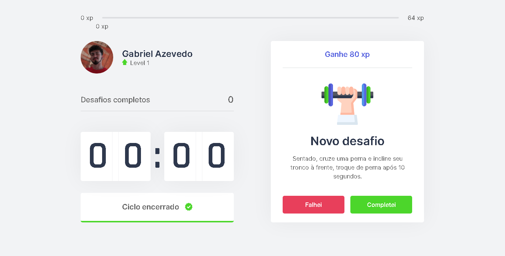

<h1 align="center">Stretch</h1>

<p align="center">
 <a href="#objetivo">Objetivo</a> •
 <a href="#Features">Features</a> • 
 <a href="#Pré-requisitos">Pré-requisitos</a> • 
 <a href="#Tecnologias">Tecnologias</a> • 
 <a href="#licenca">Licença</a> • 
 <a href="#autor">Autores</a>
</p>


### Objetivo

<p align="center">"Fazer o usuário se movimentar após um rotina de trabalho ou estudo."</p>
<p align="center"> Projeto inicialmente idealizado pela <a href="https://rocketseat.com.br/">Rocketseat</a> 🚀, nomeado como Move.it, porém com permissão de continuidade no projeto!</p>

### Features

- [ ] Cadastro de usuário
- [ ] Login de usúario
- [ ] Notificação de LevelUp
- [ ] Banco de dados com os usuários
- [ ] Botão de compartilhamento nas rede
- [ ] Ter como adicionar amigos
- [ ] Ver o progresso dos seus amigos
- [ ] Novos desafios
- [ ] Ranking

### Pré-requisitos

Antes de começar, você vai precisar ter instalado em sua máquina as seguintes ferramentas:
[Git](https://git-scm.com), [Node.js](https://nodejs.org/en/). 
Além disto é bom ter um editor para trabalhar com o código como [VSCode](https://code.visualstudio.com/)

```bash
# Clone este repositório
$ $ git clone <https://github.com/azevgabriel/nlw4react>

# Acesse a pasta do projeto no terminal/cmd
$ cd nlw4react

# Instale as dependências
$ npm install next
$ yarn install

# Execute a aplicação
$ yarn next

# O servidor iniciará na porta:3000 - acesse <http://localhost:3000>
```

### Tecnologias

As seguintes ferramentas foram usadas na construção do projeto:

- [Node.js](https://nodejs.org/en/)
- [React](https://pt-br.reactjs.org/)
- [TypeScript](https://www.typescriptlang.org/)

### Licença

🚧 Em construção... 🚧

### Autores

🚧 Em construção... 🚧

